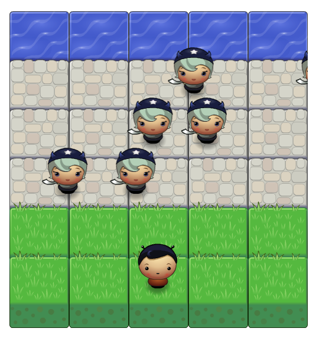

# Classic Arcade Game

Cross the road to the river while avoiding the other characters

## How to play

1. Load the game [here](https://htmlpreview.github.io/?https://github.com/alfredlua/arcade-game/blob/master/index.html).
2. Use the arrow keys to move your character around.
3. Cross the road to the river without colliding into the other characters.
4. Good luck!

## Dependencies

- HTML, CSS, and Javascript
- GitHub & BitBucket HTML Preview - Used to preview the game using the Github repo

## Spotted a bug?

I'll be grateful if you tweet me about it at [@alfred_lua](https://twitter.com/alfred_lua)!